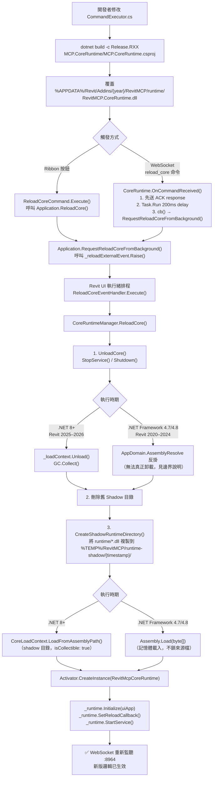

# Core-Reload 架構說明

> **適用版本**：Revit 2020–2026（R20–R26）  
> **目標讀者**：後續接手開發、貢獻 PR 或需要調整 BIM 命令邏輯的開發者  
> **最後更新**：2026-04-24（feature/loader-core-r26）

---

## 1. 為什麼需要 Core-Reload？

傳統 Revit Add-in 一旦 DLL 被載入，若要更新命令邏輯必須**完整重啟 Revit**（90–180 秒）。  
Core-Reload 機制讓你能夠：

1. 修改 Revit 命令邏輯（`CommandExecutor.cs` 等）  
2. 重新編譯 `RevitMCP.CoreRuntime.dll`
3. 在 Revit 內按一次「**Core 重載**」按鈕，或發送 `reload_core` WebSocket 命令  
4. **不重啟 Revit**，新邏輯立即生效  

每次迭代由 90–180 秒縮短至 10–25 秒，節省約 **87.5%** 的等待時間。

---

## 2. 三層架構

```
Revit 進程（常駐）
│
├── Loader 層：RevitMCP.dll          ← 重啟邊界（隨 Revit 存活）
│   ├── Application.cs               Revit IExternalApplication 入口
│   ├── Commands/MCPCommands.cs       Ribbon 按鈕命令（Toggle / Reload / Log / Settings）
│   └── Core/CoreRuntimeManager.cs   CoreRuntime 生命週期（load / unload / reload）
│
├── Contracts 層：MCP.Contracts.dll  ← 重啟邊界（介面契約，由 Loader 提供）
│   └── IRevitMcpRuntime.cs           Loader ↔ CoreRuntime 共享介面
│
└── CoreRuntime 層：RevitMCP.CoreRuntime.dll  ← 熱重載邊界
    ├── RevitMcpCoreRuntime.cs         實作 IRevitMcpRuntime
    ├── Core/CommandExecutor.cs        76+ 個 Revit 命令（Shadow-copy 載入）
    ├── Core/Commands/CommandExecutor.*.cs  各分域命令 partial class
    ├── Core/SocketService.cs          WebSocket 伺服器（HttpListener）
    └── Core/ExternalEventManager.cs  Revit UI 執行緒調度
```

### 關鍵設計原則

- **Contracts 介面必須由 Loader 的 Load Context 提供**，CoreRuntime 透過 Interface 與 Loader 溝通，避免「型別相同但來自不同 Assembly」的轉型失敗。
- **CoreRuntime 透過 Shadow-Copy 載入**，來源 DLL 不被鎖住，可隨時覆蓋再重載。
- **ExternalEvent 必須在 Revit UI 執行緒建立**，`_reloadExternalEvent` 在 `OnStartup()` 時建立並長期持有於 Loader。

---

## 3. Shadow-Copy 機制

### 為什麼需要 Shadow-Copy？

Windows 預設鎖住已載入的 DLL 檔案，無法覆蓋。Shadow-Copy 讓 CLR 從一份**暫存副本**載入，來源目錄保持可寫。

### 流程圖



---

## 4. 各 Revit 版本差異

### 4.1 .NET 執行時期對應

| Revit 版本 | 建置設定 | .NET Runtime | ElementId 型別 |
|-----------|---------|--------------|---------------|
| 2020 | Release.R20 | .NET Framework 4.7 | `int` |
| 2021 | Release.R21 | .NET Framework 4.7 | `int` |
| 2022 | Release.R22 | .NET Framework 4.8 | `int` |
| 2023 | Release.R23 | .NET Framework 4.8 | `int` |
| 2024 | Release.R24 | .NET Framework 4.8 | `int` |
| 2025 | Release.R25 | .NET 8 | `long` |
| 2026 | Release.R26 | .NET 8 | `long` |

> **環境需求（R20/R21）**：需安裝 **.NET Framework 4.7.2 Developer Pack**（winget ID: `Microsoft.DotNet.Framework.DeveloperPack_4`）。MSBuild 可以用 v4.7.2 自動滿足 `v4.7` 的目標需求，R20 已驗證可正常建置（0 errors，2026-04-24）。

### 4.2 Assembly 卸載能力

| 版本 | 卸載機制 | 說明 |
|------|---------|------|
| 2025–2026 (.NET 8) | `AssemblyLoadContext.Unload()` + GC | 完整卸載，記憶體釋放 |
| 2020–2024 (.NET FX) | `Assembly.Load(byte[])` 記憶體載入 | 舊 Assembly 留在 AppDomain 不被卸載，但**不影響命令路由**（新實例已取代舊實例），每次重載會累積微量記憶體 |

### 4.3 .NET Framework Shadow-Copy 的實際限制

`.NET Framework 4.7/4.8` 沒有 `AssemblyLoadContext`，使用 `Assembly.Load(byte[])` 搭配 `AppDomain.AssemblyResolve` 解析相依 DLL。  

**行為**：
- 舊的 `RevitMcpCoreRuntime` 物件實例被丟棄（GC 可回收）。
- 舊的 `Assembly` 物件仍掛在 AppDomain，無法強制卸載。
- 新 `Assembly.Load(byte[])` 建立新實例，新版邏輯正確執行。
- **長時間反覆熱重載**（>20 次/日），AppDomain 記憶體會緩慢增長。若有疑慮，建議每日第一次開 Revit時重新部署，而不是無限循環重載。

### 4.4 ExternalEvent 執行緒約束（全版本）

Revit API 規定：
- `ExternalEvent.Create()` → **只能在 UI 執行緒**（`OnStartup` 或 `IExternalCommand.Execute`）
- `ExternalEvent.Raise()` → 可從任何執行緒呼叫

`reload_core` WebSocket 命令從背景執行緒（`SocketService` 的 `Task.Run`）接收，因此：

```
背景執行緒  →  _reloadCallback()  →  Application.RequestReloadCoreFromBackground()
                                         └→  _reloadExternalEvent.Raise()  ← 合法
                                         
Revit UI 排程 → ReloadCoreEventHandler.Execute()  ← 真正的 ReloadCore() 在這裡執行
```

**陷阱**：舊版實作直接在 `Task.Run` 內呼叫 `ReloadCore()` → `EnsureLoaded()` → `ExternalEventManager.Instance`（初始化時呼叫 `ExternalEvent.Create()`），在背景執行緒觸發 Revit API 違規，拋出  
`Attempting to create an ExternalEvent outside of a standard API execution`

---

## 5. 關鍵新增檔案

### C# 端（Revit Add-in）

| 檔案 | 角色 | 備註 |
|------|------|------|
| `MCP.Contracts/IRevitMcpRuntime.cs` | Loader ↔ CoreRuntime 介面契約 | 新增 `SetReloadCallback(Action)` |
| `MCP.Contracts/MCP.Contracts.csproj` | 獨立 `netstandard2.0` 類別庫 | 兩層都能引用 |
| `MCP/Core/CoreRuntimeManager.cs` | CoreRuntime 生命週期管理 | Shadow-copy + load/unload |
| `MCP/Core/CoreLoadContext.cs` | .NET 8+ 自訂 ALC | `isCollectible: true`，排除 Contracts |
| `MCP.CoreRuntime/MCP.CoreRuntime.csproj` | CoreRuntime 建置設定 | link 引入 CommandExecutor 等 |
| `MCP.CoreRuntime/RevitMcpCoreRuntime.cs` | IRevitMcpRuntime 實作 | 含 `reload_core` ACK 邏輯 |

### 對現有檔案的修改

| 檔案 | 修改重點 |
|------|---------|
| `MCP/Application.cs` | 新增 `_reloadExternalEvent`、`ReloadCoreEventHandler`、`RequestReloadCoreFromBackground()` |
| `MCP/Core/SocketService.cs` | 移除 `StartAsync()` 內的 `TaskDialog.Show()`（避免 UI 執行緒阻塞 ExternalEvent） |
| `MCP/Core/CommandExecutor.cs` | `create_dimension` 回傳 `CoreVersion` 欄位（熱重載驗證用） |
| `scripts/install-addon.ps1` | 修正 `MCP.Contracts.dll` 部署來源路徑（需從 `MCP/bin/Release.RXX/` 取，而非 `MCP.Contracts/bin/`） |

### Node.js 端（驗證腳本）

| 檔案 | 角色 |
|------|------|
| `MCP-Server/scripts/core-reload-verify.js` | 端到端驗證（`--auto` 模式：before → reload → after，自動比對 CoreVersion） |

---

## 6. 部署路徑

### Addins 目錄結構（以 Revit 2022 為例）

```
%APPDATA%\Autodesk\Revit\Addins\2022\
│
├── RevitMCP.addin                        ← Revit 載入宣告（相對路徑，版本無關）
│
└── RevitMCP\                             ← Loader 目錄
    ├── RevitMCP.dll                      ← [重啟邊界] Loader
    ├── MCP.Contracts.dll                 ← [重啟邊界] 介面契約
    ├── Newtonsoft.Json.dll               ← Loader 相依
    │
    └── runtime\                          ← [熱重載邊界]
        ├── RevitMCP.CoreRuntime.dll      ← 覆蓋此檔案後 Core 重載即生效
        ├── Newtonsoft.Json.dll           ← CoreRuntime 相依
        └── ClosedXML.dll                 ← CoreRuntime 相依（Excel 匯出）
```

> **重要**：`MCP.Contracts.dll` 必須存在於 Loader 目錄（非 `runtime/`）。  
> CoreLoadContext 明確排除 `MCP.Contracts`，使其由 Revit 預設 ALC 提供，避免型別衝突。

### 各版本部署路徑

| Revit 版本 | Addins 根目錄 | CoreRuntime 路徑 |
|-----------|-------------|----------------|
| 2020 | `%APPDATA%\…\Addins\2020\RevitMCP\` | `runtime\RevitMCP.CoreRuntime.dll` |
| 2021 | `%APPDATA%\…\Addins\2021\RevitMCP\` | `runtime\RevitMCP.CoreRuntime.dll` |
| 2022 | `%APPDATA%\…\Addins\2022\RevitMCP\` | `runtime\RevitMCP.CoreRuntime.dll` |
| 2023 | `%APPDATA%\…\Addins\2023\RevitMCP\` | `runtime\RevitMCP.CoreRuntime.dll` |
| 2024 | `%APPDATA%\…\Addins\2024\RevitMCP\` | `runtime\RevitMCP.CoreRuntime.dll` |
| 2025 | `%APPDATA%\…\Addins\2025\RevitMCP\` | `runtime\RevitMCP.CoreRuntime.dll` |
| 2026 | `%APPDATA%\…\Addins\2026\RevitMCP\` | `runtime\RevitMCP.CoreRuntime.dll` |

---

## 7. 熱重載邊界

### ✅ 可熱重載（不需重啟 Revit）

以下屬於 `RevitMCP.CoreRuntime.dll` 的編譯範圍，重建後覆蓋 `runtime/` 目錄即生效：

| 類型 | 代表檔案 |
|------|---------|
| Revit 命令邏輯 | `MCP/Core/CommandExecutor.cs` |
| 分域命令 partial class | `MCP/Core/Commands/CommandExecutor.*.cs`（CurtainWall / DependentView / DetailComponent / Dimension / Sheet / SmokeExhaust / StairCompliance / WallType） |
| WebSocket 接收/發送邏輯 | `MCP/Core/SocketService.cs`（透過 link 編入 CoreRuntime） |
| ExternalEvent 命令調度 | `MCP/Core/ExternalEventManager.cs` |
| 設定存取 | `MCP/Configuration/ConfigManager.cs`, `ServiceSettings.cs` |
| 模型類別 | `MCP/Models/CommandModels.cs` |
| 相容性工具 | `MCP/Core/RevitCompatibility.cs` |

判斷依據：**是否在 `MCP.CoreRuntime.csproj` 的 `<Compile>` 或直接編入 `MCP.CoreRuntime.csproj`**

### ⛔ 仍需重啟 Revit

| 類型 | 原因 |
|------|------|
| `Application.cs`（Loader） | DLL 由 Revit 直接鎖住，無法在執行中替換 |
| `Commands/MCPCommands.cs`（Ribbon 命令） | 同上，屬 Loader |
| `IRevitMcpRuntime.cs` 介面簽章異動 | Loader 已按舊介面建立物件，轉型會失敗 |
| `CoreRuntimeManager.cs` / `CoreLoadContext.cs` | 屬 Loader，熱重載邏輯本身不能熱重載 |
| `RevitMCP.addin` / AddInId 變更 | Revit 在啟動時讀取一次 |

### 🔄 只需重啟 MCP Server（不需重啟 Revit）

| 類型 | 代表檔案 |
|------|---------|
| Tool 定義新增/修改 | `MCP-Server/src/tools/*.ts` |
| WebSocket client 邏輯 | `MCP-Server/src/socket.ts` |
| MCP 協議設定 | `MCP-Server/src/index.ts` |

---

## 8. 日常開發流程

### 修改 Core 命令（最常見，約 15 秒）

```powershell
# 1. 修改任意 CommandExecutor.*.cs

# 2. 重建 CoreRuntime（在 workspace 根目錄執行）
$env:PATH = "$env:USERPROFILE\.dotnet;$env:PATH"
dotnet build -c "Release.R22" MCP.CoreRuntime/MCP.CoreRuntime.csproj --nologo

# 3. 部署 CoreRuntime（Revit 維持開啟）
Copy-Item "MCP.CoreRuntime\bin\Release.R22\RevitMCP.CoreRuntime.dll" `
    "$env:APPDATA\Autodesk\Revit\Addins\2022\RevitMCP\runtime\" -Force

# 4a. Ribbon 觸發：Revit 工具列 → [Core 重載]

# 4b. WebSocket 觸發（自動測試）：
cd MCP-Server
node scripts/core-reload-verify.js --auto --revit 2022
```

### 修改 Loader（需重啟 Revit，約 2 分鐘）

> ⚠️ **若同時修改了 `IRevitMcpRuntime.cs`（Contracts 介面），CoreRuntime 也必須一起重建部署，**  
> 否則 Revit 啟動時會出現「方法 'XXX' 沒有實作」錯誤。  
> （實際案例：2026-04-24，R20 首次部署只更新了 Loader/Contracts，忘記重建 CoreRuntime。）

```powershell
# 1. 關閉 Revit

# 2. 重建 Loader + CoreRuntime（必須一起）
$env:PATH = "$env:USERPROFILE\.dotnet;$env:PATH"
dotnet build -c "Release.R22" MCP/RevitMCP.csproj --nologo
dotnet build -c "Release.R22" MCP.CoreRuntime/MCP.CoreRuntime.csproj --nologo

# 3. 部署 Loader + Contracts
Copy-Item "MCP\bin\Release.R22\RevitMCP.dll" `
    "$env:APPDATA\Autodesk\Revit\Addins\2022\RevitMCP\" -Force
Copy-Item "MCP\bin\Release.R22\MCP.Contracts.dll" `
    "$env:APPDATA\Autodesk\Revit\Addins\2022\RevitMCP\" -Force

# 4. 部署 CoreRuntime（確認 runtime\ 內不含 MCP.Contracts.dll）
$rt = "$env:APPDATA\Autodesk\Revit\Addins\2022\RevitMCP\runtime"
Copy-Item "MCP.CoreRuntime\bin\Release.R22\RevitMCP.CoreRuntime.dll" $rt -Force
Remove-Item "$rt\MCP.Contracts.dll" -ErrorAction SilentlyContinue

# 5. 重新開啟 Revit
```

---

## 9. 端到端驗證

`core-reload-verify.js --auto` 是此機制的標準化驗收測試：

```
[1/3] create_dimension → 取得 CoreVersion BEFORE（例：v6）
[2/3] reload_core WebSocket 命令 → Revit 收到 ACK，觸發熱重載
[3/3] 重新連線後 create_dimension → 取得 CoreVersion AFTER（例：v7）

✅ 熱重載成功！  BEFORE: v6  AFTER: v7
```

驗證 `CoreVersion` 欄位位於 `CommandExecutor.cs` 的 `create_dimension` handler，  
改此值 + 重建 CoreRuntime 是最快的「有無真正重載」判斷方式。

---

## 10. 後續改進機會

| 項目 | 說明 | 優先度 |
|------|------|-------|
| ~~**R20 建置恢復**~~ | ✅ 已完成（2026-04-24）：安裝 .NET 4.7.2 Developer Pack，R20 建置 0 errors 驗證通過 | ~~中~~ |
| ~~**R20 端到端熱重載驗證**~~ | ✅ 已完成（2026-04-24）：`v7 → reload_core → v8` 一次驗證通過；Toggle 按鈕一次點擊即生效 | ~~高~~ |
| **累積載入清理** | .NET FX 版本長時間重載後記憶體緩慢增長，可考慮每日自動警告 | 低 |
| **多版本同時驗證** | `core-reload-verify.js` 加入 `--all-versions` 模式，同時測試 R22/R24/R25 | 中 |
| **CI 整合** | GitHub Actions 執行 MCP Server unit test + 建置驗證（不含 Revit 本體） | 高 |
| **Contracts 版本管理** | 在 `IRevitMcpRuntime` 加入 `Version` 屬性，Loader 載入時自動比對，版本錯配時給出明確錯誤 | 高 |
| **熱重載 rollback** | 重載失敗時自動回復上一個 shadow-copy | 低 |

---

## 11. 除錯速查

| 症狀 | 可能原因 | 對策 |
|------|---------|------|
| `MissingMethodException: SetReloadCallback` | Addins 目錄的 `MCP.Contracts.dll` 是舊版 | 重新部署 `MCP\bin\Release.RXX\MCP.Contracts.dll` |
| **「方法 'SetReloadCallback' 沒有實作」**（Revit 啟動錯誤對話框）| Loader/Contracts 已更新（含新介面），但 `runtime/RevitMCP.CoreRuntime.dll` 是舊版，未實作新方法 — **常見於只部署 Loader 而未重建 CoreRuntime 的情況（例如：版本初次部署、只跑 `install-addon.ps1` 而未跑 CoreRuntime build）** | 1. `dotnet build -c "Release.RXX" MCP.CoreRuntime/MCP.CoreRuntime.csproj` <br>2. 將 `MCP.CoreRuntime\bin\Release.RXX\*.dll` 複製至 `%APPDATA%\…\{year}\RevitMCP\runtime\` <br>3. 確認 `runtime\` 內沒有 `MCP.Contracts.dll`（需刪除，防型別衝突）<br>4. 重啟 Revit |
| `Attempting to create ExternalEvent outside...` | 在背景執行緒呼叫 `ExternalEvent.Create()` | 確認 `ExternalEventManager.Instance` 初始化在 UI 執行緒 |
| Core 重載後命令 timeout（8s） | `StartAsync()` 有 `TaskDialog.Show()` 阻塞 UI | 確認 `SocketService.StartAsync()` 無 `TaskDialog`（已修復） |
| CoreVersion 重載後未變化 | `runtime/` 目錄的 DLL 未更新，或 shadow-copy 取了舊快照 | 確認部署時間戳晚於重載時間；檢查 `%TEMP%\RevitMCP\runtime-shadow\` |
| `CoreRuntime 型別不存在` | CoreRuntime DLL 建置失敗，型別名稱變更 | 確認 `RevitMCP.CoreRuntime.RevitMcpCoreRuntime` 類別存在 |
| Port 8964 被 PID 4 佔用，Revit 顯示「Port監聽: 是」但 WebSocket 連線 timeout | HTTP.sys 孤兒 Request Queue（Revit 上次異常關閉殘留）。`HttpListener.Start()` 在 HTTP.sys 共用模式下不會拋出例外，`_isRunning` / `IsListening` 顯示正常，但實際封包被孤兒 Queue 吃掉無法路由至 Revit | **最可靠解法：重開機**（HTTP.sys 孤兒 Queue 在重開機時自動清除）。<br>若不能重開機，以管理員 PowerShell 逐行執行：<br>`net stop http /y`（Print Spooler / SSDP 會一起停）<br>`net start http`<br>`net start spooler`<br>**注意：不可用 `&&` 串連（PowerShell 不支援）；`DO NOT` 任意更改 port 8964** |
| ~~**MCP 服務需按兩次才生效**~~（已修復） | Toggle 按鈕原本使用 `IsServiceConnected()`（外部 MCP Server 是否連線）而非 `IsRunning` 作為判斷依據，服務啟動後 MCP Server 尚未連線導致第一次按鈕無效 | ✅ 已修復（2026-04-24）：`ToggleServiceCommand` 改用 `IsServiceRunning()` 判斷，重建部署 Loader 後一次點擊即可 |
