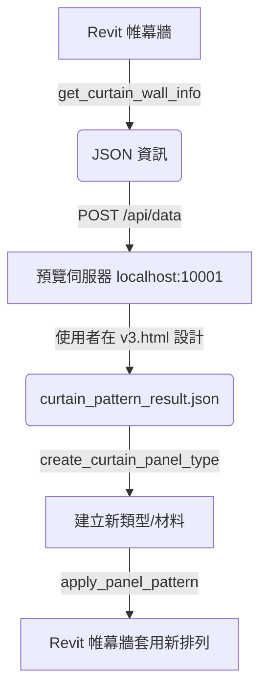

# 帷幕牆面板排列工作流程

## 📋 概述

本工作流程允許使用者透過網頁預覽工具，視覺化設計帷幕牆的面板排列模式，並將設計套用到 Revit 模型中。此流程涵蓋了從取得資訊、設計預覽到建立新類型與自動化套用的完整路徑。

## � 所需 MCP 工具與技術規格

### 1. `get_curtain_wall_info`
**功能**：取得選中帷幕牆的 Grid 結構與 Panel 資訊。
**技術細節**：
- **Revit API 類別**：`CurtainGrid` (取得垂直/水平 GridLineIds, PanelIds)。
- **座標轉換**：將 Grid 幾何位置轉換為 Row/Column 索引（Row 0 為最上方，Column 0 為最左側）。

### 2. `get_curtain_panel_types`
**功能**：列出專案中所有可用的 Curtain Panel Types。
**回傳格式**：包含 `TypeId`, `TypeName`, `Family` 等資訊。

### 3. `create_curtain_panel_type`
**功能**：根據指定的顏色與名稱建立新的 Panel Type 及其關聯材料。
**命名標準**：材料命名格式為 `CW_PNL_[描述]_[序號]`（例如 `CW_PNL_OceanBlue_01`）。

### 4. `apply_panel_pattern`
**功能**：根據 2D 排列矩陣批次修改 Revit 中的 Panel Types。
**關鍵方法**：`CurtainGrid.ChangePanelType(Element panel, ElementType newSymbol)`。

---

## 🔄 資料流概覽



---

## 🚀 執行步驟

### 步驟 1：啟動預覽伺服器
```powershell
cd MCP-Server
node scripts/curtain_preview_server.js
```
伺服器將運行於 `http://localhost:10001` 並提供 `curtain_wall_preview_v3.html`。

### 步驟 2：取得帷幕牆資訊並推播
在 Revit 中選取帷幕牆後執行：
```powershell
node scripts/test_curtain_wall.js
```
此步驟會輸出預覽所需的 JSON 資料（未來可更新為自動發送 `POST` 到伺服器）。

### 步驟 3：網頁視覺化設計
開啟瀏覽器，在預覽界面進行：
- 選擇排列模式（offset, stripe, checkerboard, random 等）。
- 自訂色彩或套用色彩主題。
- 點擊 **「確認套用」** 儲存結果。

### 步驟 4：套用設計回 Revit
執行腳本將網頁設計結果寫回 Revit：
```powershell
node scripts/apply_curtain_pattern.js
```
腳本會自動檢查是否需要建立新類型，並執行批次更換面板。

---

## ⚠️ 開發與作業注意事項

1. **Revit API 限制**：
   - 所有更改必須在 `Transaction` 中執行。
   - 某些系統面板（如嵌入式牆）可能無法更換類型，腳本會記錄在 `FailedPanels`。
2. **Grid 方向**：
   - **V Grid** = 垂直線 = 定義 Column（寬度方向）。
   - **U Grid** = 水平線 = 定義 Row（高度方向）。
3. **已存在類型**：若名稱重複，`create_curtain_panel_type` 會更新既有類別的顏色而非重複建立。

---

## 📁 相關資源位置

| 檔案 | 說明 |
|:----|:----|
| `MCP/Core/CommandExecutor.cs` | C# 工具底層實作 |
| `MCP-Server/src/tools/revit-tools.ts` | MCP 工具定義與通訊層 |
| `MCP-Server/scripts/curtain_preview_server.js` | 預覽伺服器 |
| `MCP-Server/scripts/curtain_wall_preview_v3.html` | 預覽工具 UI |
| `MCP-Server/scripts/test_curtain_wall.js` | 取得帷幕牆資訊腳本 |
| `MCP-Server/scripts/apply_curtain_pattern.js` | 套用排列模式腳本 |
| `MCP-Server/scripts/curtain_pattern_result.json` | 使用者設定結果 |
