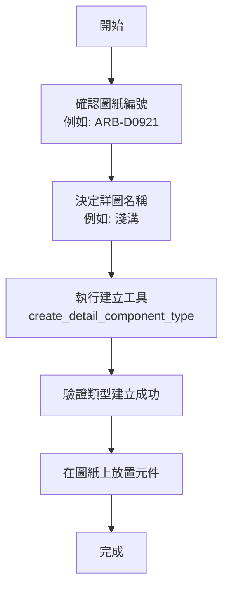
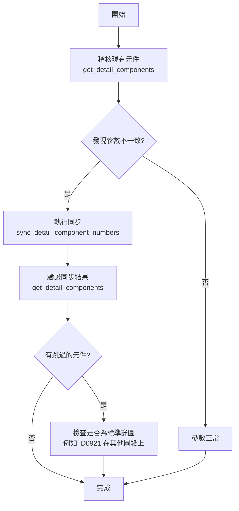

# 詳圖元件同步工作流程

## 📋 概述

本文檔說明如何使用 RevitMCP 工具管理 Revit 專案中的詳圖元件標頭（Detail Component Headers），包括查詢、建立類型、同步參數等操作。

**核心目標：** 確保詳圖標頭的「類型名稱」、「詳圖圖號」與「圖說名稱」參數與所在圖紙保持一致。

## 🎯 適用場景

- 新建詳圖標頭類型（手動精準控制）
- 批次同步詳圖標頭參數與圖紙編號
- 修正參數不一致的詳圖標頭
- 圖紙重編號後的參數更新

## 🔧 核心工具

### 1. get_detail_components
**用途：** 查詢專案中的詳圖元件

**輸入參數：**
```json
{
  "familyName": "AE-圖號"
}
```

**輸出格式：**
```json
{
  "Items": [
    {
      "ElementId": 9969446,
      "TypeName": "ARB-D0408-物流中心 外牆剖面圖一-鋼浪板屋頂",
      "FamilyName": "AE-圖號詳圖編號標頭-3.5mm",
      "SheetNumber": "ARB-D0408",
      "Parameters": {
        "詳圖圖號": "ARB-D0408",
        "圖說名稱": "物流中心 外牆剖面圖一"
      }
    }
  ]
}
```

**使用時機：**
- 稽核專案中所有詳圖標頭
- 檢查參數一致性
- 作為同步前的前置查詢

---

### 2. create_detail_component_type
**用途：** 手動建立新的詳圖標頭類型

**輸入參數：**
```json
{
  "sheetNumber": "ARB-D0921",
  "detailName": "淺溝"
}
```

**執行邏輯：**
1. 查詢圖紙 `ARB-D0921` 的名稱（例如：`物流中心 陰井、排水溝、淺溝、水箱人孔詳圖`）
2. 建構類型名稱：`ARB-D0921-物流中心 陰井、排水溝、淺溝、水箱人孔詳圖-淺溝`
3. 複製基礎類型（如 `D09XX`）
4. 設定類型參數：
   - `詳圖圖號` = `ARB-D0921`
   - `圖說名稱` = `物流中心 陰井、排水溝、淺溝、水箱人孔詳圖`
   - `詳圖名稱` = `淺溝`

**輸出格式：**
```json
{
  "Success": true,
  "TypeId": 123456,
  "TypeName": "ARB-D0921-物流中心 陰井、排水溝、淺溝、水箱人孔詳圖-淺溝",
  "Message": "成功建立詳圖元件類型"
}
```

**使用時機：**
- 需要為新圖紙建立專屬的詳圖標頭類型
- 精準控制類型命名與參數
- 避免自動建立產生的冗餘類型

> [!IMPORTANT]
> 此工具提供**手動精準控制**，是 v3.2 之後推薦的類型建立方式。

---

### 3. sync_detail_component_numbers
**用途：** 同步詳圖標頭參數與圖紙編號

**輸入參數：** 無

**執行邏輯（v3.6 Dual Safeguard Mode）：**
1. 掃描所有圖紙及其視埠，建立「視圖 → 圖紙」對應表
2. 找出所有 `AE-圖號` 系列元件（支援 `OST_DetailComponents` 和 `OST_GenericAnnotation`）
3. 對每個元件：
   - 查詢其所在圖紙
   - **作法一：檢查類型名稱是否以該圖紙編號開頭**
   - **作法二：檢查圖紙編號是否以類型名稱中的圖紙前綴開頭**
   - 若匹配，更新 `詳圖圖號` 與 `圖說名稱` 參數
   - 若不匹配，**跳過**（保護標準/共用詳圖）

**輸出格式：**
```json
{
  "Success": true,
  "UpdatedInstances": 14,
  "TypesCreated": 0,
  "Message": "同步完成：更新了 14 個標頭元件，建立了 0 個新類型。"
}
```

**防護機制（v3.6 核心特性）：**
```
範例 1：匹配 → 更新
- 元件類型：ARB-D0408-物流中心 外牆剖面圖一-鋼浪板屋頂
- 所在圖紙：ARB-D0408
- 結果：作法一匹配，更新參數

範例 2：不匹配 → 跳過
- 元件類型：ARB-D0921-物流中心 陰井、排水溝、淺溝、水箱人孔詳圖-淺溝
- 所在圖紙：AR-B-D02X2
- 結果：跳過（保護標準詳圖）

範例 3：圖紙編號以前綴匹配 → 更新
- 元件類型：ARB-D05-物流中心 詳圖索引
- 所在圖紙：ARB-D05001
- 結果：作法二匹配，更新參數
```

**使用時機：**
- 定期維護專案參數一致性
- 圖紙名稱變更後的批次更新
- 確保「圖紙編號已匹配」的元件參數正確

> [!WARNING]
> v3.5 **不會自動建立新類型**，也**不會自動更名類型**。若需新類型，請使用 `create_detail_component_type`。

---

### 4. get_detail_component_families + sync_detail_component_sheet_fields（參數比對雙向檢核）

不綁死家族名與參數名的彈性檢核修正流程（2026-07 新增，pyRevit「詳圖編號同步」按鈕即此流程）：

**步驟：**
1. `get_detail_component_families`：列出詳圖元件/通用註解家族與其文字類型參數（含範例值），供使用者選擇家族、指定哪個參數放「圖紙號碼」、哪個放「圖紙名稱」。
2. `sync_detail_component_sheet_fields`：掃描全專案圖紙建立「號碼 ↔ 名稱」對照，依 `matchBy` 選定主鍵方向檢核並修正另一欄：
   - `matchBy=sheetNumber`（以圖紙號碼為主）：信任圖號參數 → 用它找圖紙 → 修正名稱參數。
   - `matchBy=sheetName`（以圖紙名稱為主）：信任名稱參數 → 反向修正圖號參數。

**參數：** `familyName`（必填）、`matchBy`、`sheetNumberParameter`（如 `詳圖圖號`）、`sheetNameParameter`（如 `圖說名稱`）、`dryRun`（預設 true）、`renameTypes`（預設 true）、`detailNameParameter`（預設 `詳圖名稱`）。

**逐筆狀態：** `ok` 一致／`update|updated` 需修正、已修正／`empty_key` 主鍵空值／`not_matched` 查無圖紙／`ambiguous` 圖紙名稱重複（列候選、不寫入）／`target_unwritable` 目標參數不可寫。

**類型名稱同步改名（`renameTypes=true` 時）：** 修正參數的同時，將匹配到圖紙的類型依命名規範改名為 `{圖紙號碼}-{圖紙名稱}-{詳圖名稱}`。詳圖名只「偵測」使用者自行 key in 的 `detailNameParameter`（預設「詳圖名稱」）類型參數——工具只讀取、絕不寫入該參數。逐筆改名狀態：`name_ok` 已符合／`rename|renamed` 需改名、已改名／`rename_conflict` 目標名稱已存在（不改，需人工處理）／`no_detail_name` 詳圖名稱參數為空（跳過改名，只改參數）。pyRevit 按鈕由使用者在 UI 選擇「詳圖名稱」參數（預設排最前），選定後才執行類型改名。

**注意：** 圖紙號碼在 Revit 內唯一，但圖紙名稱可能重複——以名稱為主時重複名稱一律標 `ambiguous` 不自動修正，需人工裁決。

---

## 📐 命名規範

### 類型名稱格式
```
{圖紙編號}-{圖紙名稱}-{詳圖名稱}

範例：
ARB-D0921-物流中心 陰井、排水溝、淺溝、水箱人孔詳圖-淺溝
│      │                                          │
圖紙編號  圖紙名稱                                    詳圖名稱
```

### 參數對應
| 參數名稱 | 來源 | 範例 |
|:--------|:-----|:-----|
| **詳圖圖號** | 圖紙編號 | `ARB-D0921` |
| **圖說名稱** | 圖紙名稱 | `物流中心 陰井、排水溝、淺溝、水箱人孔詳圖` |
| **詳圖名稱** | 使用者輸入 | `淺溝` |

---

## 🔄 標準工作流程

### 流程 1：新建詳圖標頭類型



**執行步驟：**
1. 確認目標圖紙編號（如 `ARB-D0921`）
2. 決定詳圖名稱（如 `淺溝`、`水溝`、`陰井`）
3. 使用 `create_detail_component_type` 建立類型
4. 在 Revit 中將新類型的元件放置到對應圖紙上

---

### 流程 2：批次同步參數



**執行步驟：**
1. 使用 `get_detail_components` 稽核所有詳圖標頭
2. 檢查參數是否與圖紙一致
3. 使用 `sync_detail_component_numbers` 批次同步
4. 驗證同步結果
5. 若有跳過的元件，確認是否為「標準詳圖被引用到其他圖紙」的正常情況

---

## 📚 版本演進歷史

### v1.0 - 初始版本（已廢棄）
- **方法：** Viewport-Based Approach
- **問題：** 無法處理直接放在圖紙上的元件

### v2.0 - Element-First Approach（已廢棄）
- **改進：** 從元件出發查詢所在圖紙
- **問題：** 參數映射不完整

### v3.0 - 正確參數映射
- **改進：** 修正參數對應邏輯
- **行為：** 自動建立新類型並同步

### v3.1 - 精準名稱解析
- **改進：** 
  - 修正 `ARB-D0214` 重複段落問題
  - 擴大掃描範圍（支援 `OST_GenericAnnotation`）

### v3.2 - Update-Only Mode ⭐
- **重大變更：** 只更新參數，不自動建立新類型
- **原因：** 避免產生冗餘類型
- **新增：** `create_detail_component_type` 工具（手動建立）

### v3.2.1 - Sheet-Level Instance Support
- **修正：** 支援直接放在圖紙上的元件

### v3.2.2 - Move-If-Exists Mode（已廢棄）
- **嘗試：** 自動切換到匹配的類型
- **問題：** 邏輯過於複雜

### v3.3 - Consistency Mode（已廢棄）
- **嘗試：** 智慧連動更名（圖紙重編號時自動更名類型）
- **嚴重問題：** 誤改標準/共用詳圖（如 `ARB-D0921` 被改為 `AR-B-D02X2`）

### v3.4 - 參數格式調整
- **調整：** 確認 `詳圖圖號` 使用完整格式（含 `ARB-` 前綴）

### v4.0 - Sequential Fuzzy Match ⭐⭐⭐⭐
- **重大變更：** 實作 `async/await` 順序執行機制，解決大規模寫入（>50 條指令）時的穩定性問題。
- **改進：** 加入強型態名稱正規化（Normalization），支援全半形轉換、自動移除括號與符號、自動排除 placeholder。
- **策略：** 當資產編號格式不一時（如 `ARB-D09001` vs `AR-B-D0901`），改以「前置 ID 提取」或「正規化名稱包含了」作為次要比對手段。
- **性能：** ✅ 已驗證，可穩定處理 100+ 個同時同步請求而不遺漏指令。

---

## ⚠️ 常見問題與解決方案

### Q1: 為什麼同步後有些元件沒有被更新？
**原因：** v3.5 的防護機制會跳過「類型名稱與圖紙編號不匹配」的元件。

**判斷方法：**
```
元件類型：ARB-D0921-物流中心 陰井、排水溝、淺溝、水箱人孔詳圖-淺溝
所在圖紙：AR-B-D02X2

類型名稱開頭：ARB-D0921
圖紙編號：AR-B-D02X2
結果：不匹配 → 跳過
```

**解決方案：**
- 若這是**標準詳圖被引用**：這是正常行為，無需處理
- 若需要更新：先使用 `create_detail_component_type` 為該圖紙建立專屬類型，然後手動切換元件類型

---

### Q2: 如何為新圖紙建立詳圖標頭？
**推薦流程：**
1. 使用 `create_detail_component_type` 建立專屬類型
2. 在 Revit 中放置該類型的元件到圖紙上
3. 執行 `sync_detail_component_numbers` 確保參數正確

**不推薦：** 直接複製其他圖紙的元件（會導致類型名稱不匹配）

---

### Q3: 圖紙重編號後如何更新詳圖標頭？
**情境：** 圖紙從 `ARB-D0930` 改為 `ARB-D0938`

**v3.5 行為：**
- 同步工具**不會自動更名類型**
- 類型名稱仍為 `ARB-D0930-...`
- 因為名稱不匹配，參數**不會被更新**

**解決方案：**
1. **手動更名類型**：在 Revit 中將類型名稱改為 `ARB-D0938-...`
2. **執行同步**：`sync_detail_component_numbers` 會更新參數
3. **或建立新類型**：使用 `create_detail_component_type` 建立 `ARB-D0938` 類型，手動切換元件

> [!NOTE]
> v3.5 刻意移除自動更名功能，以避免誤改標準詳圖。圖紙重編號需要手動介入。

---

### Q4: 什麼是「標準詳圖」？為什麼要保護它？
**標準詳圖定義：**
- 通用的詳圖類型（如 `ARB-D0921-淺溝`）
- 可以被多張圖紙引用
- 參數應保持與「原始圖紙」一致

**範例：**
```
ARB-D0921 圖紙：陰井、排水溝、淺溝、水箱人孔詳圖
- 包含 3 種詳圖：淺溝、水溝、陰井

AR-B-D02X2 圖紙：全棟高架車道剖面圖(2/2)
- 引用了 D0921 的「淺溝」詳圖（作為參考）
```

**若不保護會發生什麼：**
- `ARB-D0921-淺溝` 的參數會被錯誤更新為 `AR-B-D02X2`
- 原始 D0921 圖紙上的標頭也會顯示錯誤的編號

**v3.5 保護機制：**
- 偵測到類型名稱（`ARB-D0921`）與圖紙編號（`AR-B-D02X2`）不符
- 自動跳過，不更新參數

---

## 🎯 最佳實踐

### ✅ 推薦做法
1. **新圖紙**：使用 `create_detail_component_type` 建立專屬類型
2. **定期同步**：每週執行一次 `sync_detail_component_numbers`
3. **標準詳圖**：建立通用類型（如 `D09XX`），供多張圖紙引用
4. **命名規範**：嚴格遵循 `{圖紙編號}-{圖紙名稱}-{詳圖名稱}` 格式

### ❌ 避免做法
1. **不要**直接複製其他圖紙的詳圖標頭
2. **不要**手動修改參數（應透過同步工具維護）
3. **不要**期待同步工具自動建立新類型（v3.2 之後已移除）
4. **不要**期待同步工具自動更名類型（v3.5 已移除）

---

## 🔗 相關工作流程

- [圖紙與視埠管理](sheet-viewport-management.md) - 圖紙編號規範與管理
- [元素上色工作流程](element-coloring-workflow.md) - 視覺化相關操作

---

## 📝 開發建議

### 待實作功能
1. **batch_create_detail_types** - 批次建立多個詳圖類型
2. **validate_detail_consistency** - 驗證參數一致性報告
3. **migrate_detail_type** - 批次切換元件類型（圖紙重編號輔助）

### 改進方向
- 提供「圖紙重編號」專用模式（可選的自動更名）
- 支援詳圖標頭模板（預設參數配置）
- 自動偵測「孤兒類型」（無元件使用的類型）並清理

---

**最後更新：** 2026-05-20  
**當前版本：** v5.1 PDF OCR Inclusive Review  
**維護者：** RevitMCP Team
---

## 2026-05-19 雙模式詳圖項目同步優化

### 背景

本次針對 `AE-圖號詳圖編號標頭-3.5mm`、`AE-矩形框詳圖元件` 等詳圖項目的類型參數同步，補強並保留兩種作法：

- **模式 A：由圖紙 Viewport 建立/更新類型**
- **模式 B：由既有類型參數反查並修正圖紙號碼**

這兩種作法不應互相取代。前者適合建立、完整同步、改名；後者適合既有類型已建立，只需要依類型參數修正 `詳圖圖號`。

### 模式 A：由圖紙 Viewport 建立/更新

工具：`create_detail_component_types_from_sheet_viewports`

適用情境：

- 使用者指定一張或多張圖紙號碼，需要依圖紙上的所有 Viewport 建立或更新詳圖項目類型。
- 需要同步 `詳圖圖號`、`圖說名稱`、`詳圖編號`、`詳圖名稱`。
- 需要把舊的「視圖名稱版」類型名稱，更新為「圖紙上的標題版」類型名稱。

參數來源規則：

- `詳圖圖號` = 圖紙例證參數 `圖紙號碼`
- `圖說名稱` = 圖紙例證參數 `圖紙名稱`
- `詳圖編號` = 視埠例證參數 `詳圖編號`
- `詳圖名稱` = 視埠或視圖參數 `圖紙上的標題`；若空值，fallback `視圖名稱`
- 類型名稱 = `詳圖圖號-圖說名稱-詳圖名稱`

執行注意：

- `overwriteExisting=true` 時，可更新既有類型參數。
- 若偵測到舊類型名稱使用 `視圖名稱`，而新規則應使用 `圖紙上的標題`，工具可將 legacy type rename/update 到新名稱。
- 家族名稱必須優先精確比對，避免使用者指定 `AE-矩形框詳圖元件` 時誤套用到 `AE-矩形框詳圖元件標籤`。

### 模式 B：由既有類型參數反查圖紙號碼

工具：`sync_detail_component_sheet_numbers_by_type_parameters`

適用情境：

- 詳圖項目類型已存在，且類型參數 `圖說名稱`、`詳圖名稱` 已可信。
- 使用者希望依這兩個參數偵測對應圖紙，僅修正類型參數 `詳圖圖號`。
- 不希望重新建立類型，也不希望批次改名。

參數比對規則：

- 讀取詳圖項目類型參數：`圖說名稱` + `詳圖名稱`
- 建立圖紙 Viewport 對照表：同時索引 `圖紙上的標題` 與 `視圖名稱`
- 找到唯一匹配時，更新 `詳圖圖號`
- 找不到匹配時回報 `not_matched`
- 多重匹配時回報 `ambiguous`

執行注意：

- 預設應先使用 `dryRun=true` 檢查結果。
- `not_matched` 與 `ambiguous` 應視為需要人工檢查的資料，不應強制寫入。
- 此模式只處理 `詳圖圖號` 修正，不負責完整參數重建。

### 選用原則

- 要建立、改名、完整同步詳圖項目類型：使用模式 A。
- 要保留既有類型，只依 `圖說名稱 + 詳圖名稱` 修正 `詳圖圖號`：使用模式 B。
- 來源是 PDF/OCR/外部整理表，且不依賴 Revit ViewSheet：使用 `create_detail_component_types_from_metadata`。
- 大量圖紙操作先 dry run，確認 `created`、`updated`、`renamed_updated`、`not_matched`、`ambiguous` 後再正式執行。

### 模式 C：由 PDF/OCR 或外部 metadata 建立

工具：`create_detail_component_types_from_metadata`

適用情境：

- 詳圖資料來自新版 PDF、OCR 結果、Excel 清單或人工校正表。
- Revit 內尚未建立對應圖紙，或不希望依賴 ViewSheet。
- 已整理出 `詳圖圖號`、`圖說名稱`、`詳圖編號`、`詳圖名稱`。

規則：

- 類型名稱 = `詳圖圖號-圖說名稱-詳圖名稱`
- 寫入類型參數：`詳圖圖號`、`圖說名稱`、`詳圖編號`、`詳圖名稱`
- 預設 `dryRun=true`，OCR 來源正式寫入前必須先人工確認。

---

## 2026-05-19 PDF OCR v2/v4 規則：先抓大號碼，再找附近大字標題

從 PDF 建立詳圖項目類型時，不可只依版面排序推導 `詳圖編號`。排序法容易被圖框座標、尺寸數字、標題欄、材料註記與重複詳圖名稱干擾。

建議偵測優先序：

1. 先偵測圖面區域中最大字體的數字，作為詳圖號碼候選。
2. 排除圖框座標、尺寸數字、標題欄文字與專案資訊。
3. 在號碼附近找同樣屬於頁面大字體的繁體中文標題；小字註記、材料說明、尺寸文字即使含有 `詳` 或 `圖` 也先忽略。
4. 合併緊貼標題、且位在同一基準線上的英數前綴，例如 `3F,5F` 或 `C3,C9`；這些前綴屬於 `詳圖名稱`，不是註記。
5. 在剩餘候選中，優先採用含有 `詳` 或 `圖`、且文字最長的附近標題。
6. 若多個號碼對應到相同 `詳圖名稱`，只建立一個類型，並將 `詳圖編號` 寫成範圍或清單，例如 `1-5`、`1,3,7`。
7. 若 OCR 漏讀圓圈號碼，只能在 preview 階段用相鄰序列補判，並標記為 `sequence_fallback`。

除非使用者明確要求，不得用 OCR 結果覆蓋已經人工修正過的 Revit 詳圖項目類型參數。

---

## 2026-05-20 PDF OCR v5 規則：紅框註解優先，圓圈圖頭備援

V5 的目標是降低「整頁 OCR 猜錯詳圖名稱」的機率，並保留人工可介入的流程。V5 目前先作為 preview/metadata 產生流程，不直接寫入 Revit。

腳本：

- `tmp/pdf_ocr_300/build_v5_preview.py`

資料來源優先序：

1. **紅框註解模式**：若 PDF 頁面有紅色 `/Square` 註解框，將紅框視為使用者指定的 `詳圖名稱` 範圍。直接讀紅框座標，再擷取框內 OCR 文字。
2. **圓圈圖頭模式**：若該頁沒有紅框，先從圖像偵測圖頭底線右側的圓圈，讀取圓圈內數字作為 `詳圖編號`，再往左找同一基準線的大字繁體中文標題作為 `詳圖名稱`。
3. **順序補判**：若圓圈位置存在但圈內數字 OCR 漏讀，只能在 preview 階段依版面順序補判，並標記 `sequence_fallback` 與人工複核。

重要限制：

- 紅框模式只代表「此文字是詳圖名稱」，不代表 OCR 文字絕對正確；仍需套用錯字修正與人工複核清單。
- 圓圈模式必須過濾圖框座標、尺寸數字、施工說明、材料註記、表格與標題欄。
- 標題候選需優先包含 `詳圖`、`立面圖`、`剖面圖`、`平面圖`、`操作圖`、`標示` 等詳圖名稱關鍵字。
- 任何 `sequence_fallback`、紅框空值、缺少詳圖關鍵字、或 OCR 修正過的項目，都應進入 review-only 清單。
- V5 metadata 經使用者確認後，才可交給 `create_detail_component_types_from_metadata` dry run；正式寫入前仍需再次確認。

---

## 2026-05-20 PDF OCR v5 inclusive 規則：V5 主判斷、V4 補漏、人工查核

### 背景

純 V5 的判斷策略較精準，但不保證數量會與 V4 相同。原因是 V5 主要依賴紅框註解、圓圈圖頭與同基準線大字標題，會主動排除許多疑似材料註記、尺寸文字與施工說明；V4 較寬鬆，因此數量較多，但錯字與誤抓風險也較高。

當使用者明確表示「可以不用那麼保守」、「先建出來，後續人工查核」時，應改用 V5 inclusive 流程：

- V5 作為主要來源。
- V4/OCR 作為補漏來源。
- 補漏與低信心項目全部列入人工查核報告。
- 最終仍可先寫入 Revit，讓使用者在 IDE、CSV 或 Revit 內人工修正。

### 工具腳本

- `tmp/pdf_ocr_300/build_v5_preview.py`：產生純 V5 preview。
- `tmp/pdf_ocr_300/build_v5_inclusive_preview.mjs`：合併 V5 與 V4 補漏。
- `tmp/pdf_ocr_300/apply_v5_preview_to_revit.mjs`：批次送入 `create_detail_component_types_from_metadata`。

### 合併規則

1. 先讀取純 V5 的 `detail_metadata_v5_preview.json`。
2. 再讀取 V4 的 `detail_metadata_v4_preview.json`。
3. 若 V4 項目的 `詳圖圖號 + 詳圖編號` 已被 V5 命中，視為 V5 已覆蓋，不再採用 V4。
4. 剩餘 V4 項目作為補漏項目，`sourceModes` 加入 `v4_fallback`，並標記 `review=true`。
5. 寫入 Revit 前，依 `詳圖圖號 + 正規化後詳圖名稱` 分組。
6. 同一組若有多個詳圖編號，合併為單一類型，詳圖編號以範圍或清單表示，例如 `1-5`、`4,8`、`8,10,17`。
7. 類型名稱保持 `詳圖圖號-圖說名稱-詳圖名稱`，不包含詳圖編號。

### 產出與查核

V5 inclusive 應輸出下列檔案：

- `detail_metadata_v5_inclusive_preview.json`
- `detail_metadata_v5_inclusive_review_report.md`
- `detail_metadata_v5_inclusive_all_types.csv`
- `detail_metadata_v5_inclusive_review_only.csv`
- `v5_inclusive_preview_apply_progress.json`
- `v5_inclusive_preview_apply_result.json`

`review_report.md` 與 `review_only.csv` 是人工校核主入口。只要項目來自 V4 補漏、使用順序補判、缺少詳圖關鍵字、或經 OCR 錯字修正，都應出現在 review 清單中。

### 寫入 Revit 的執行經驗

- 建議每批約 20 筆，序列化呼叫 `create_detail_component_types_from_metadata`，避免 Revit UI thread 或 WebSocket 回應互相干擾。
- 若前一輪已建立類型，後續 inclusive 修正通常會得到 `updated`，不是 `created`；這代表既有類型被覆寫更新，不是失敗。
- 若同名多編號未先合併，Revit 會對同一類型重複 update，最後只留下最後一次詳圖編號；因此合併必須在送入 Revit 前完成。
- Node/WebSocket 腳本可能在 Revit 寫入完成後仍等待連線收尾，使 Codex 看起來仍在運行。套用腳本應在成功或失敗後寫出 progress/result JSON，並明確結束程序。

### 目前經驗值

以 `大樣詳圖ALL-1.pdf` 測試時，純 V5 不一定能覆蓋 V4 的全部數量。較適合實務的做法是：

- 使用純 V5 提供主要、較可信的候選。
- 使用 V4 補漏，避免大量缺項。
- 將不確定項目建立出來，但同時列入人工查核。

此策略承認 OCR 不會 100% 正確，重點是把「可批次建立」與「可人工查核」兩件事分開處理。
