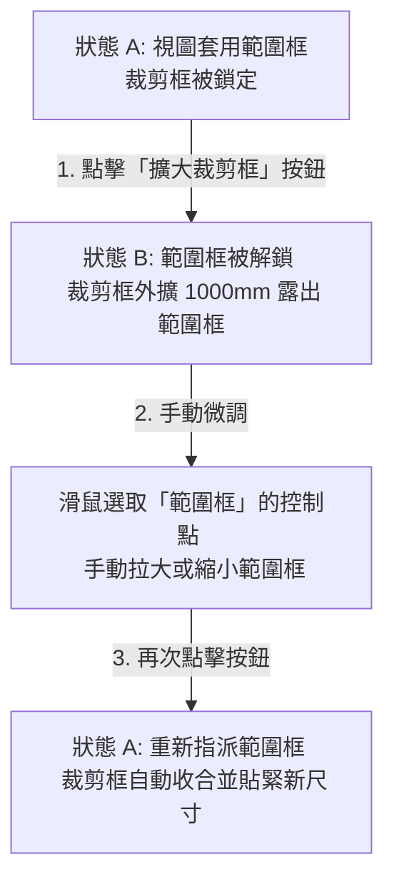

# 🌿 範圍框無痛調整工具 — 操作說明與設計邏輯
(`ExpandCropBox.pushbutton`)

本文件記錄了為解決大型 Revit 專案中，調整「範圍框（Scope Box）」尺寸時因為取消範圍框導致 Revit 重新載入整張大圖、大量工作集所引起的嚴重卡頓問題。

> [!NOTE]
> **工具可用性說明**：本工具目前僅限於 **pyRevit 客戶端使用者**在 Revit 軟體內以加載外掛按鈕的形式使用。**目前此工具的功能尚未註冊至 MCP 伺服器的無頭 (Headless) 代理工具集中。**

---

## 🚀 核心工作流 (Workflow)

為確保大型專案中**視圖標註不遺失**、**其他套用同範圍框的視圖不損壞**，且**完全避免 Revit 卡頓**，我們設計了「**手動拉動範圍框 ➔ 程式自動收合貼齊**」的雙狀態循環（Toggle Loop）操作流程。

請在 Revit 中配合使用本工具按鈕，依序執行以下三步驟：



### 📍 第一步：程式外擴裁剪框
*   **動作**：在已套用範圍框的視圖上，點擊 **「擴大裁剪框」** 按鈕。
*   **程式行為**：
    1. 自動在背景記憶當前視圖所套用的範圍框 ID（透過 Revit 專利的 `Extensible Storage` 安全儲存於視圖中）。
    2. 解除視圖與範圍框的關聯（將範圍框設為 `<無>`）。
    3. 自動將視圖裁剪框的四邊**向外擴大 1000mm**，並啟用裁剪框可見。
*   **效果**：**完全不會卡頓**，且裁剪框被推開後，原本重疊隱藏在底下的「範圍框」會完整顯露出來。

### 📍 第二步：手動調整範圍框
*   **動作**：此時因為裁剪框已經被程式推開 1000mm，您可以在視圖上**用滑鼠直接選取「範圍框」**。
*   **手動操作**：點選範圍框，利用範圍框四周的藍色三角形控制點，手動拉大或縮小（例如從 20x20 拉大到 50x50）。

### 📍 第三步：程式自動收合對齊
*   **動作**：當您手動將範圍框尺寸拉好後，**再次點擊同一顆「擴大裁剪框」按鈕**。
*   **程式行為**：
    1. 讀取視圖元數據中記憶的範圍框 ID。
    2. 將該範圍框重新指派回此視圖的「範圍框」參數。
*   **效果**：視圖一旦重新套用該範圍框，Revit 原生機制會**自動將裁剪框「啪」一聲收合，精確貼齊並鎖定**到您剛才拉好的新範圍框尺寸（例如 50x50）。快取隨之清除，完成一個完美的循環！

---

## 🛠️ 技術設計亮點

1.  **無破壞性 (Non-destructive)**：
    由於 Revit API 不開放直接透過程式碼修改 `VolumeOfInterest` (範圍框) 幾何邊界的限制，本工具採取「暫時解除 ➔ 指派還原」的做法。不採取「刪除舊框、重建新框」的手段，因此**不會造成其他套用此範圍框的視圖標註失效或關聯遺失**。
2.  **零延遲 (Zero Lag)**：
    避免了在大型平面圖上直接將範圍框設為 `<無>` 時，Revit 載入大範圍幾何所引起的嚴重凍結卡頓。
3.  **無感狀態記憶 (State Persistence)**：
    利用 Revit 的 `Extensible Storage` 儲存快取，即使使用者在第一步與第三步之間關閉檔案或重開 Revit，狀態記憶依然安全綁定在視圖上，不會造成程式崩潰或錯亂。
4.  **支援復原 (Ctrl+Z Undo)**：
    第一步（`Expand Crop Box by 1000mm`）與第三步（`Re-associate Scope Box`）分別包裝在獨立且命名清晰的 Revit Transaction 中，使用者可以隨時透過 `Ctrl+Z` 復原 any 一步。

---

## 💻 核心實作代碼概念 (Core Code Concept & Prompts)

提供其他 AI Agent 友善開發的提示指引，以下為本工具的關鍵概念邏輯與 API 互動指引：

### 🔑 關鍵開發步驟提示

1.  **快取 Schema 機制**：
    必須建立一個具有固定 GUID 的 `Schema`，並註冊一個儲存最後被解鎖範圍框 ID (通常為 string/int) 的簡單欄位：
    ```python
    # 提示：建立儲存 schema 的基礎宣告
    builder = SchemaBuilder(SCHEMA_GUID)
    builder.SetSchemaName("ScopeBoxToggleStorage")
    builder.AddSimpleField("LastScopeBoxId", str)
    ```

2.  **狀態 A（解除與外擴 1000mm）**：
    *   使用 `VolumeOfInterest.get_BoundingBox(active_view)` 獲取範圍幾何。
    *   藉由 `view.get_Parameter(BuiltInParameter.VIEWER_VOLUME_OF_INTEREST_CROP).Set(ElementId.InvalidElementId)` 暫時解除鎖定。
    *   計算 `1000.0 / 304.8` 換算成英呎（Revit 內部單位），並手動給予四角 `BoundingBoxXYZ` 的 Min/Max 各自外擴此偏移量後指派給 `view.CropBox`。

3.  **狀態 B（收合與還原）**：
    *   如果偵測到快取中有值，直接用 `Set()` 方法重新將範圍框 ID 指派回 `VIEWER_VOLUME_OF_INTEREST_CROP`。Revit 將自動收合並完成對齊。
    *   請務必在 `Transaction` 成功 commit 後執行快取清空，以確保循環正常。

---
**文件維護者**：CYBERPOTATO0416 / Antigravity
**更新日期**：2026-06-20
