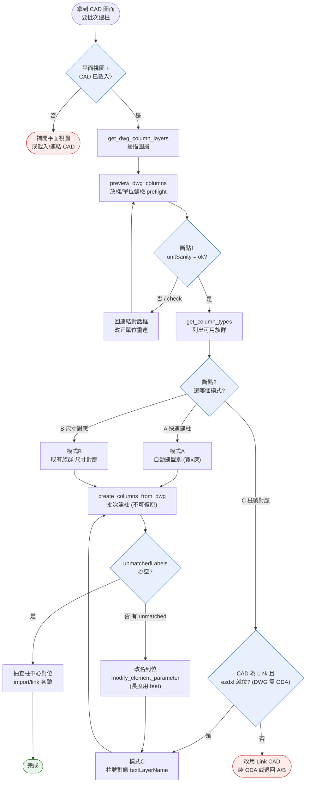

# DWG/DXF 圖層批次建柱 SOP

把 CAD 圖面中的矩形柱輪廓批次轉成 Revit 結構柱/建築柱，並可依 CAD 柱號標注（C1、C2…）讓柱沿用既有族群的命名。

- 來源 fork：幾何建柱 `s9101800111-byte`（作者 lt0106）；柱號對應 `Roy-y111`（作者 ROY，2026-06-16）。
- 對應工具：`get_dwg_column_layers` → `preview_dwg_columns` → `create_columns_from_dwg`，外加 `create_level`、`get_column_types`/`list_family_symbols`（family 選擇）。
- 對應實作：`MCP/Core/DwgColumnExecutor.cs`、`MCP/Core/Commands/CommandExecutor.Level.cs`、`bridge/python/skills/ezdxf_worker.py`。

> **核心原則（與 AI 協作）**：建柱不可自動復原，**不要一口氣跑完**。照「掃描 → 放樣/單位斷點 → 選 family 模式斷點 → 建柱」逐步走，每個斷點向使用者複述並取得同意，避免單位連結錯誤或族群誤判造成整批錯誤建模。

---

## 0. 三模式（依情境選用，互為並行關係）

| 模式 | 何時用 | 參數 | 型別命名行為 |
|---|---|---|---|
| **A 自動建型別** | 只要把柱建出來、不在意型別命名 | `layerName`（不給 `familyName`） | 自動挑最適族群（含「混凝土/Concrete/RC」+「矩形/Rect」最高分）+ 依尺寸建 `寬x深`（cm）新類型 |
| **B 既有族群·尺寸對應** | 已有指定族群，要依尺寸沿用它的現有類型 | `layerName` + `familyName` | 在該族群現有類型中**依尺寸**比對、沿用原名；缺尺寸才 Duplicate |
| **C 既有族群·柱號對應** | CAD 有柱號標注，要讓柱沿用 C1/C2 等命名 | `layerName` + `familyName` + `textLayerName` | 依 **CAD 柱號文字**比對族群類型；找不到回 `unmatchedLabels`、**不亂建** |

模式由情境關鍵字驅動（見 skill `dwg-column-import`）：提到「柱號 / 對應名稱 / C1 C2」→ 模式 C；指定族群但只談尺寸 → 模式 B；只想快速建柱 → 模式 A。**選哪個模式本身就是一個斷點**：列出可用族群讓使用者裁決，不要替使用者預設。

---

## 1. 前置條件（缺一不可）

1. **Revit 開在平面視圖**：三個工具都要求 `doc.ActiveView` 為 `ViewPlan`，否則丟「請在平面視圖中執行」。
2. **CAD 已匯入或連結到該視圖**：用 `get_dwg_column_layers` 確認視圖內至少一個 `ImportInstance`。
3. **（模式 B/C）專案已載入目標矩形柱族**，且（模式 C）族群內有對應柱號的類型名稱（如 `C1`、`C3a_100 x 60`）。模式 A 會自動挑族群，挑不到丟「找不到…族群」。
4. **柱輪廓畫在獨立圖層**（見 §4.1）。
5. **（模式 C）CAD 須為「連結 CAD（Link）」**且系統有 Python + `ezdxf`；DWG 另需 ODA File Converter（見 §3）。

---

## 2. 工作流（強制斷點版）

| 步驟 | 工具 | 作用 | 斷點 |
|---|---|---|---|
| 1 掃描 | `get_dwg_column_layers` | 列出視圖 CAD 圖層、推薦柱圖層、回報 Link/Import 與 CAD 數 | — |
| 2 **放樣/單位健檢** | `preview_dwg_columns(layerName)` | 回傳每柱 x/y(mm)、寬深、旋轉角、尺寸分組，**及 `preflight`（單位健檢 + 放樣範圍 + 警示）** | ⛔ **斷點 1**：複述數量·尺寸·單位·放樣，待使用者確認「第一步定位放樣對」 |
| 3 選 family 模式 | `get_column_types` / `list_family_symbols` | 列出可用族群/類型供選擇 | ⛔ **斷點 2**：使用者選 A/B/C 與 `familyName`/`textLayerName` |
| 4 建柱 | `create_columns_from_dwg(...)` | 批次建柱 | 回報 created/typesUsed/unmatchedLabels；有 unmatched **停下協作**，不續建 |

**斷點 1 — 單位/放樣是第一要務。** 參考 DWG/DXF 建模，定位放樣、尺寸、單位在第一步就得正確；錯了後面全錯。`preview` 的 `preflight` 欄位提供前端檢查資料：

- `preflight.unitSanity`：`ok` / `check`。
- `preflight.warnings`：例如「N 根斷面 <100mm：連結單位可能偏小（DXF 實為 cm/m 卻以 mm 連結？）」。**看到 `check` 一定先停**，回連結對話框改正單位重做，不要硬建。
- `preflight.sizeRangeMm` / `extentMm`：斷面尺寸跨度與放樣範圍，抽核是否落在合理柱斷面（100–3000mm）與正確圖面範圍。

**鐵則**：執行步驟 4 前一定先過斷點 1 的數量與尺寸是否合理，避免在錯圖層或錯比例下建出大量錯柱。

### 2.1 流程圖（`/domain-diagram` 腳本產出）

下圖由 `.claude/skills/domain-diagram/scripts/mermaid_from_spec.py` 從結構化 spec 確定性產出（非手繪）：

**流程健檢結論**（腳本自動 + 人工）：

- [項1] **人工確認** — 兩個迴圈皆為有界退出：`preview → d1 → fixunit → preview`（使用者改正連結單位後收斂）、`create → d3 → rename → modeC → create`（unmatchedLabels 全數對應後收斂）。
- [項2/3/4] **OK** — 無死路／不可達節點；兩個 abort 出口（`abpre`、`abC`）皆可達；五個決策（`pre`/`d1`/`d2`/`dC`/`d3`）分支皆完備且具標示。
- [項5] **人工** — 前置缺口：§1 前置條件（平面視圖、CAD 已載入、模式 B/C 族群已載入）即此流程的 baseline，已於 `pre` 與斷點顯式把關。
- [項6] **人工** — 原子性：`create_columns_from_dwg` 不可復原（§6），故以斷點 1／2 在「寫入前」攔截，而非寫入後回滾。

---

## 3. DXF / DWG 通用（不鎖死 DXF）

模式 C 讀柱號文字走 `ezdxf_worker.py` 子程序，**兩種格式都支援**，只是 DWG 多一個外掛需求：

| 格式 | 需求 | 失敗回報 |
|---|---|---|
| **DXF** | 系統 Python + `pip install ezdxf` | `labelReadStatus=no_worker`（找不到 worker）/ `error` |
| **DWG** | 上述 + **ODA File Converter**（`ezdxf.addons.odafc`） | `labelReadStatus=no_oda`（柱仍建立，僅不對應名稱，並附安裝指引） |

- `ezdxf_worker.py` 由 `install-addon.ps1` 自動部署到 `%APPDATA%\RevitMCP\`；`DwgColumnExecutor.FindWorkerScript` 依「dll 同層 → 開發樹 bridge/ → %APPDATA%\RevitMCP」尋找。
- DWG 無 ODA 時是**優雅降級**（柱照建、不對應名稱），不是硬性失敗——把 `labelReadStatus` 回報給使用者決定是否裝 ODA 或改用 DXF。
- 幾何建柱（模式 A/B、`preview`）不經 Python，DXF/DWG 皆可，無此外掛需求。

---

## 4. 關鍵工程確認點

### 4.1 以 LAYER 指定，不是顏色／線型
識別靠 `GraphicsStyleCategory.Name`（＝CAD 圖層名）。柱輪廓放**獨立、命名清楚的圖層**（含「柱/COL」可被自動推薦）；同圖層混雜其他圖元會被一起當候選矩形。

### 4.2 import 與 link 都讀幾何，但讀柱號文字只能用 link
- **讀柱輪廓（幾何，模式 A/B/C 都要）**：import 與 link 皆可。
- **讀柱號文字（`textLayerName`，模式 C）**：**只能 Link CAD**。Import CAD 無法取得原始檔路徑（`GetExternalFileReference()` 丟例外），工具會擋並提示改用 Link。

### 4.3 基準點／座標／單位（放樣驗收，最重要）
柱位置 = CAD 幾何經 `GetInstanceGeometry()`（已套 ImportInstance transform）後的模型內部座標；Z 取 `ViewPlan.GenLevel`，頂部抓「高於基準層的最近一層」。
- **未處理** shared coordinates／survey point 額外換算——柱落在「CAD 連結後在 Revit 的實際位置」。
- **因此**：CAD 連結時就要對位正確（原點、比例、**單位**）。`$INSUNITS=0`（無單位 DXF）時，Revit 連結對話框要選對單位（cm/mm），否則 `preview.preflight` 會以尺寸異常警示。
- **柱號對應的單位自動偵測**（模式 C 內部）：`ReadLabelsFromCad` 對柱號文字座標試算 mm/cm/m/inch/ft 五種比例，選「讓標注最靠近柱輪廓」者；`create` 回傳的 `matchDebug` 會列 `raw=(原始座標) lblPos=(換算後mm) dist=`，`dist≈0` 表示對位成功。此偵測獨立於 Revit 連結單位，但**幾何仍須先連結對位正確**（斷點 1 把關）。
- **驗收**：建柱後抽查幾根柱中心是否落在 CAD 柱輪廓中心；import 與 link 各驗一次。

### 4.4 族群協作選擇（模式 B/C，不要替使用者預設）
建柱前用 `get_column_types`（含 FamilyName/TypeName/尺寸）或 `list_family_symbols` 列出可用族群，**互動式讓使用者挑**要用哪個族群、走 B 還是 C。這是斷點 2。

- **善用現有 family 直接調用**：使用者選定族群後，模式 C 直接以柱號比對其現有類型，到位即用。
- **缺類型時的「改名到位」協作**：若族群缺對應柱號類型，可先以模式 A/B 建出尺寸型別，再用 `modify_element_parameter` 改名 + 改參數成 C1/C2…，再以模式 C 重跑。**這是逐步協作流程，不應一口氣完成。**
  - ⚠️ **`modify_element_parameter` 單位陷阱**：長度/尺寸參數值是 **Revit 內部單位（feet）不是 mm**。設 600mm 寬要傳 `600/304.8 = 1.9685`，直接傳 `600` 會變 600 英尺（182880mm）。
  - 改名：`parameterName="Name"`（亦接受 `名稱`/`類型名稱`/`-1002001`）；`Element.Name` 字面不被攔截。
  - **未來增強建議**：把族群選擇做成「互動式 family 選單」（先列再選），並讓 `modify_element_parameter` 依參數類型自動換算單位，免去呼叫端手動轉 feet。

### 4.5 族群偵測與尺寸規則
- 自動偵測寬/深參數名（多語言別名：b/B/寬度/寬/柱寬/Width/w…；h/H/深度/深/Depth/d…），偵測不到改用「50–5000mm 範圍內 Double 參數」由小到大當寬、深。
- 尺寸 **5mm 量化**；**100–3000mm 範圍外的矩形視為非柱被濾掉**；近正方形旋轉角歸零。
- 模式 A/B 缺對應尺寸時自動 `Duplicate` 新類型，命名 `寬x深`（cm），衝突加尾號。**模式 C（textLayerName）不自動建類型**——找不到對應就跳過並回 `unmatchedLabels`。

---

## 5. 柱號比對邏輯（模式 C，同 BIMAssistant `find_or_create_type` 三段優先序）
1. 完整名稱完全符合（`C3a(100×60)` ＝ 類型名）。
2. 代號前綴符合（從 `C3a(100×60)` 萃取 `C3a` → 找 `C3a_…`、`C3a-…`、`C3a`）。
3. 代號前綴 + 尺寸雙重符合（防代號相同尺寸不同時誤判）。
- 每根柱找 2000mm 內最近的標注；超過容許距離則退回模式 A/B 的尺寸建型別。

---

## 6. 已知限制與實機驗證
- 斷面須為**矩形**，但不挑畫法：封閉 PolyLine（含倒角／多頂點）、四條 Line 迴圈、圖塊 block(INSERT) 皆可；圓柱、L 形、異形不支援。
- 同位置 50mm 內視為重複柱自動去重；一次只處理一個圖層；`create_columns_from_dwg` 不可自動復原。
- **案例 1（2026-06-09，FL1）**：13 頂點倒角 polyline，`preview` 識別 30 根，`create` **30/30 成功**、自動選「混凝土柱-矩形」族（模式 A）。
- **案例 2（2026-06-16，2FL 汀洲路）**：DXF `$INSUNITS=0`（實為 cm），柱輪廓 `S-COLS-CONC`、柱號 `S-COLS-LABL`（`C3a(100×60)`），族群 `2_RC柱-矩形`。自動偵測單位 cm，前綴比對 `C3a_100 x 60`，**12/12 成功、unmatchedLabels 空**（模式 C）。
- **案例 3（2026-06-18，回溯驗證）**：合成 mm 檔與 `$INSUNITS=0` cm 檔各跑模式 C，`matchDebug` 兩者 `dist=0`（mm raw=12000、cm raw=1200 都收斂同位置），證單位自動偵測；happy path 建出 C1~C5 六根、`unmatchedLabels` 空。

## 7. 附：create_level
`create_level(elevation, name?)`：以公釐標高建樓層（自動 /304.8 轉 feet）。重複會在 `Warning` 提示但仍建。常用於建柱前補頂部樓層（否則丟「找不到高於…的樓層」）。

## 8. QA／驗收清單
- [ ] 平面視圖 + CAD 已載入，`get_dwg_column_layers` 有回傳圖層
- [ ] **斷點 1**：`preview` 的 `preflight.unitSanity=ok`、尺寸/放樣範圍合理（單位/定位是第一要務）
- [ ] **斷點 2**：已列出族群、與使用者確認模式（A/B/C）與 familyName/textLayerName
- [ ] （模式 C）CAD 為 Link、worker 就位、DXF 直讀或 DWG+ODA
- [ ] 建柱後抽查中心對位（import 與 link 各驗）
- [ ] 頂部樓層存在（否則先 `create_level`）
- [ ] created/failed 比例正常，`unmatchedLabels` 為空或已與使用者協作處理
